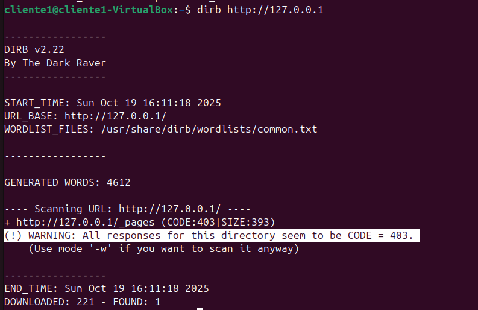

# Proyecto de Hardening de Servidor Web

Este documento detalla los pasos para replicar el entorno de servidor seguro.

---

## FASE 1: Montaje del Laboratorio y Configuración Inicial

En esta fase inicial, desplegamos un **servidor web Apache** funcional sobre **Ubuntu  22.04 LTS**. 
El objetivo es establecer una base sólida y automatizada.

### Proceso Automatizado

Para garantizar una instalación limpia y repetible, gran parte del proceso se ha automatizado en un script de Bash.


**[Script de Instalación Inicial](../../scripts/Script_instalacion_inicial.md)**


Este script realiza las siguientes acciones clave:

1.  **Actualiza el sistema operativo** para asegurar que todas las librerías están al día.
2.  **Instala el servicio `apache2`**.
3.  **Crea un directorio web personalizado** en `/var/www/mi-proyecto-web`, separándolo de la configuración por defecto.
4.  **Asigna la propiedad del directorio** al usuario `www-data`, que es una buena práctica de seguridad para que Apache gestione sus propios ficheros.

### Ejecución

Para desplegar este Hito, simplemente ejecuta el script con permisos de superusuario desde la raíz del proyecto:

```bash
# Dar permisos de ejecución al script
chmod +x scripts/install_dependencies.sh

# Ejecutar el script
sudo ./scripts/install_dependencies.sh
```

### Verificación por Terminal

Tras ejecutar el script, la correcta creación del fichero y la asignación de permisos se pueden verificar directamente desde la terminal. Estos comandos confirman que el objetivo de la Fase 1 se ha cumplido.


<p align="center">
    
</p>

<p align="center">
    
</p>
<p align="center">
    
</p>


## FASE 2: Configuración de Apache.

En esta fase, configuramos Apache para aumentar su seguridad tras la instalación por defecto.  

---

### 2.1. Configuración de un Virtual Host

Para gestionar nuestro sitio de forma independiente y profesional, se ha creado un fichero de Virtual Host específico: `/mi-proyecto.conf`. Esto permite que el servidor responda a un nombre de dominio y tenga su propia configuración aislada.

El fichero de configuración se encuentra en `/etc/apache2/sites-available/mi-proyecto.conf` y contiene la siguiente estructura:

``` Apache
<VirtualHost *:80>
    ServerAdmin webmaster@localhost
    DocumentRoot /var/www/mi-proyecto-web
    ServerName mi-proyecto.local
    
    ErrorLog ${APACHE_LOG_DIR}/error.log
    CustomLog ${APACHE_LOG_DIR}/access.log combined

    ErrorDocument 404 /404.html
    ErrorDocument 403 /403.html
</VirtualHost>
```


Se han utilizado las directivas `a2ensite` y `a2dissite` para activar esta nueva configuración y desactivar la que viene por defecto.

### 2.2. Creación y Activación del Fichero `.htaccess`

Para gestionar la seguridad a nivel de directorio, se ha habilitado el uso de ficheros `.htaccess` en la configuración del Virtual Host mediante la directiva `AllowOverride All`.

Se ha creado un fichero `.htaccess` en la raíz del directorio web (`/var/www/mi-proyecto-web`) con una primera regla de seguridad fundamental: protegerse a sí mismo de ser visualizado desde un navegador.

**Contenido inicial del fichero `.htaccess`:**
```apache
# Proteger el fichero .htaccess para que no sea visible desde la web
<Files ".htaccess">
    Require all denied
</Files>
```

# Fase 3: Implementación de Defensa Activa

En esta fase, añadimos capas de seguridad proactivas diseñadas para detectar y bloquear automáticamente actividades maliciosas comunes, como el **Fuzzing Web**, los ataques de **Fuerza Bruta** y los **accesos no autorizados**.

### 3.1. Mitigación de Ataques de Fuerza Bruta con `mod_evasive`

Para proteger el servidor contra ataques de fuerza bruta y de denegación de servicio (DoS) a nivel de aplicación, se ha instalado y configurado el módulo de Apache `mod_evasive`.

Este **módulo rastrea la cantidad de peticiones realizadas por cada dirección IP** y, si superan un umbral predefinido en un corto periodo de tiempo, **bloquea temporalmente a esa IP** devolviéndole un código de error 403 (Forbidden).

La configuración aplicada se encuentra en `/etc/apache2/mods-available/evasive.conf` y establece los siguientes umbrales:


```
<IfModule mod_evasive20.c>
    DOSHashTableSize    3097
    DOSPageCount        2
    DOSSiteCount        50
    DOSPageInterval     1
    DOSBlockingPeriod   10
    
    DOSEmailNotify      tu@tudominio.com
    DOSystemCommand    "sudo /sbin/iptables -A INPUT -s %s -j DROP"
    DOSLogDir           "/var/log/mod_evasive"
</IfModule>
```

Podemos comprobar su instalación con el comando :

```
apache2ctl -M | grep evasive
```

Que debería arrojarnos una salida  `evasivce20_module (shared)` en caso de que este activado. 

A continuación reiniciamos el servicio de Apache con cualquiera de estos dos comandos y que se apliquen los cambios. :

```
sudo service apache2 reload
```

o

```
sudo systemctl reload apache2
```


Como comprobación hacemos dos pruebas:
1. Recargamos unas cuantas veces nuestra página y nos manda a la página de `Forbbiden`:

<p align="center">
    
</p>

2. Lanzamos la herramienta `dirb` que nos devuelve un código 403.
<p align="center">
    
</p>


Todo este tráfico lo vemos recogido en el archivo `error.log`  . Que será muy útil  para futuras investigaciones. 

```
sudo tail -f /var/log/apache2/error.log
```
<p align="center">
    
</p>


### 3.2. Protección de Directorios con Contraseña (.htpasswd)

Para añadir una capa de seguridad adicional y restringir el acceso a todo el sitio web, se ha implementado la autenticación básica de Apache. Este método es ideal para proteger áreas administrativas o sitios en desarrollo de accesos no autorizados. Fuerza una ventana de autentificación en el navegador antes de mostrar el contenido.

El sistema se basa en un fichero `.htpasswd` que almacena usuarios y contraseñas hasheadas, y se activa mediante directivas en el fichero `.htaccess` del sitio.

El proceso se llevó a cabo en dos pasos:

1.  **Creación del fichero de contraseñas:** Se utilizó el comando `htpasswd -c` para crear un fichero `.htpasswd` en la raíz del directorio web. Este fichero almacena los nombres de usuario y las contraseñas de forma segura (hasheadas).

2.  **Activación en `.htaccess`:** Se añadieron las siguientes directivas al fichero `.htaccess` para forzar la autenticación:


```
# --- REGLAS DE AUTENTICACIÓN ---
AuthType Basic
AuthName "Acceso Restringido al Portfolio"
AuthUserFile /var/www/mi-proyecto-web/.htpasswd
Require valid-user
```

<p align="center">
    
</p>

<p align="center">
    
</p>

### 3.3. Securización de Subida de Archivos

Se ha implementado una funcionalidad de subida de archivos. Para mitigar los riesgos de seguridad asociados a esta característica.

#### A. Configuración del Entorno

El servidor Apache se configuró para procesar correctamente los scripts PHP mediante la instalación de los paquetes `php` y `libapache2-mod-php`. 

```
sudo apt-get update
sudo apt-get install php libapache2-mod-php 
```

```
sudo apt-get install libapache2-mod-security2 
```

```
sudo systemctl restart apache2
```
<p align="center">
    
</p>


#### B. Lógica de Validación en el Backend (`upload.php`)

El script `upload.php` se ha dotado de una lógica de validación estricta que se ejecuta en el servidor antes de procesar cualquier fichero.

**1. Filtrado de Extensiones por una Whitelist.**

Para prevenir la subida de *web shells* u otros ficheros potencialmente maliciosos, se ha implementado un filtro que solo acepta extensiones pre-aprobadas. Cualquier otra extensión es rechazada.

```php
// Lista blanca de extensiones permitidas
$allowedExtensions = ['jpg', 'jpeg', 'png', 'gif', 'pdf', 'txt', 'docx'];

// Lógica de validación
$fileExtension = strtolower(pathinfo($fileName, PATHINFO_EXTENSION));
if (!in_array($fileExtension, $allowedExtensions)) {
    // Si la extensión no está en la lista, se detiene la ejecución
    exit("Error: Tipo de archivo no permitido.");
}
```

**2. Control de Tamaño Máximo de Fichero**

Para mitigar ataques de Denegación de Servicio (DoS) que busquen agotar el espacio en disco, se ha establecido un límite estricto en el tamaño de los ficheros.

```PHP
// Límite de 5 Megabytes
$maxSize = 5 * 1024 * 1024; // 5 MB en bytes

// Lógica de validación
$fileSize = $_FILES['file']['size'];
if ($fileSize > $maxSize) {
    // Si el fichero supera el límite, se detiene la ejecución
    exit("Error: El archivo supera el tamaño máximo de 5 MB.");
}
```

En caso de no cumplir con la whitelist o con el tamaño que hemos reglamentado el usuario vera este mensaje:

<p align="center">
    
</p>


Por el contrario si cumple con las reglas vera:
<p align="center">
    
</p>


#### C. Hardening del Directorio de Subida (`/uploads`)

Finalmente, se ha securizado el directorio donde se almacenan los ficheros para impedir que un atacante pueda explorar su contenido.

<p align="center">
    
</p>


**1. Prevención de Listado de Directorios**

Se ha creado un fichero `.htaccess` dentro de la carpeta `/uploads` con la siguiente directiva para prohibir explícitamente el listado de su contenido:

```
Options -Indexes
```

La efectividad de esta regla se apoya en la activación del módulo `mod_rewrite` y la configuración de `AllowOverride All` en el Virtual Host del servidor. Como resultado, cualquier intento de acceder directamente a la carpeta `/uploads` devuelve un error 403 (Forbidden).

<p align="center">
    
</p>

### 3.4. Implementación de Web Application Firewall (WAF) con `mod_security`

Como capa de defensa principal contra ataques a la aplicación web (XSS, SQLi, etc.), se ha implementado `mod_security` con el Core Rule Set (CRS) de OWASP.

Comenzamos viendo que tenemos un panel vulnerable a xss.

<p align="center">
    
</p>

#### Proceso de Implementación

El despliegue se realizó siguiendo estos pasos clave:

**1. Instalación y Activación del Módulo**

Se instaló el paquete del motor del WAF y se activó el módulo correspondiente en Apache.

```bash
sudo apt install libapache2-mod-security2 -y
sudo a2enmod security2
``` 


**2. Configuración del Motor de Reglas**

Se habilitó la configuración por defecto y se modificó para operar en modo de bloqueo activo.

Se copia la plantilla de configuración para preservar el original

```bash
sudo cp /etc/modsecurity/modsecurity.conf-recommended /etc/modsecurity/modsecurity.conf
```

Dentro de este nuevo fichero, se cambió la siguiente directiva clave para pasar del modo de "solo detección" al de "bloqueo":

``` Apache
# Activa el motor de reglas para detectar y bloquear ataques
SecRuleEngine On
```


**3. Despliegue del Core Rule Set (OWASP CRS)**

Se clonó la última versión del set de reglas directamente desde el repositorio oficial de OWASP para asegurar la máxima protección.

```bash
cd /etc/modsecurity sudo git clone https://github.com/coreruleset/coreruleset.git cd coreruleset sudo cp crs-setup.conf.example crs-setup.conf
```


**4. Integración de las Reglas con Apache**

Finalmente, se editó el fichero de configuración del módulo de Apache para que cargara el set de reglas de OWASP en cada inicio. 

Para ello, se añadieron las siguientes líneas al final de `/etc/apache2/mods-enabled/security2.conf`:

```Apache
IncludeOptional /etc/modsecurity/coreruleset/crs-setup.conf
IncludeOptional /etc/modsecurity/coreruleset/rules/*.conf
```


Tras la implementación del WAF hemos protegido contra la vulnerabilidad XSS como podemos comprobar en la siguiente imágenes:
<p align="center">
    
</p>

<p align="center">
    
</p>
